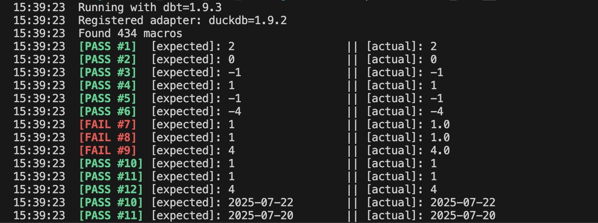

# Overview

The `dbt_macros_unit_testing` is  lightweight dbt package for unit testing your dbt macros.

It enables you to define tests for other macros or SQL expressions, logging structured success/failure messages directly in the dbt output. 

It supports both **pure Jinja expressions and SQL queries**, making it ideal for validating macro logic and data transformations

<br>


### 🔗 Quick link to available Unit Tests documentation:
- [Equality](#equality)
- [Numeric Comparison](#numeric-comparison)
- [In / Not in](#in--not-in)
- [Null / None](#null--none)

<br>

# Installation

Add the package to your `packages.yml` file:

```yaml
packages:
  - git: "https://github.com/vvaneecloo/dbt-macro-unit-testing"
    revision: main
```

Run `dbt deps` to install the package.

<br>
<br>

# Available Assertions

A comprehensive collection of assertion macros for testing Jinja2 templates, particularly useful for dbt macro testing and validation.

<br>

### Equality

#### `assertEqual(test_number, macro_to_test_with_args, expected, is_query=False)`
Tests that the macro result equals the expected value.

**Parameters:**
- `test_number`: Unique identifier for the test
- `macro_to_test_with_args`: The macro call with its arguments
- `expected`: The expected result value
- `is_query`: Optional boolean flag (default: False)

**Example:**
```jinja
{{ assertEqual(1, my_macro('input'), 'expected_output') }}
```

#### `assertNotEqual(test_number, macro_to_test_with_args, expected, is_query=False)`
Tests that the macro result does not equal the expected value.

**Example:**
```jinja
{{ assertNotEqual(2, my_macro('input'), 'wrong_output') }}
```

<br>

### Numeric Comparison

#### `assertGreater(test_number, macro_to_test_with_args, expected, is_query=False)`
Tests that the macro result is greater than the expected value.

**Example:**
```jinja
{{ assertGreater(3, calculate_sum([1,2,3]), 5) }}
```

#### `assertLesser(test_number, macro_to_test_with_args, expected, is_query=False)`
Tests that the macro result is less than the expected value.

**Example:**
```jinja
{{ assertLesser(4, calculate_average([1,2,3]), 3) }}
```

<br>

#### `assertLessEqual(test_number, macro_to_test_with_args, expected, is_query=False)`
Tests that the macro result is less than or equal to the expected value.

**Example:**
```jinja
{{ assertLessEqual(5, get_count(), 10) }}
```

#### `assertGreatEqual(test_number, macro_to_test_with_args, expected, is_query=False)`
Tests that the macro result is greater than or equal to the expected value.

**Example:**
```jinja
{{ assertGreatEqual(6, get_minimum_value(), 0) }}
```

<br>

### In / Not in

#### `assertIn(test_number, macro_to_test_with_args, expected, is_query=False)`
Tests that the macro result is contained within the expected collection.

**Example:**
```jinja
{{ assertIn(7, get_status(), ['active', 'inactive', 'pending']) }}
```

#### `assertNotIn(test_number, macro_to_test_with_args, expected, is_query=False)`
Tests that the macro result is not contained within the expected collection.

**Example:**
```jinja
{{ assertNotIn(8, get_user_role(), ['admin', 'superuser']) }}
```

<br>

### Null / None

#### `assertNone(test_number, macro_to_test_with_args, expected=None, is_query=False)`
Tests that the macro result is None/null.

**Parameters:**
- `expected`: Optional parameter (defaults to None)

**Example:**
```jinja
{{ assertNone(9, get_optional_value()) }}
```

#### `assertNotNone(test_number, macro_to_test_with_args, expected=None, is_query=False)`
Tests that the macro result is not None/null.

**Example:**
```jinja
{{ assertNotNone(10, get_required_field()) }}
```

<br>

## Usage Patterns

### Basic Test Structure
```jinja
{# Test suite for my_utility_macro #}
{{ assertEqual(1, my_utility_macro('test'), 'expected_result') }}
{{ assertNotEqual(2, my_utility_macro('test'), 'wrong_result') }}
{{ assertGreater(3, my_utility_macro('number'), 0) }}
```

<br>

### Testing with Complex Arguments
```jinja
{# Testing macro with multiple parameters #}
{{ assertEqual(
    1, 
    complex_macro(param1='value1', param2=['a','b','c'], param3=true), 
    expected_complex_result
) }}
```

<br>

### Query-based Testing
```jinja
{# When testing macros that generate SQL queries #}
{{ assertEqual(
    1, 
    generate_sql_macro('table_name'), 
    'SELECT * FROM table_name',
    is_query=true
) }}
```

<br>

## Output Format

The macro provides colored console output for easy identification of test results:

### Success Output
```
✅ [PASS #1] [expected]: $1,000.00 || [actual]: $1,000.00
```

### Failure Output
```
❌ [FAIL #2] [expected]: 150 || [actual]: 142
```

### Example of real unit testing logs



## Best Practices

1. **Use sequential test numbers** - This helps track which assertions pass or fail
2. **Group related tests** - Keep assertions for similar functionality together via a dedicated macro
3. **Test edge cases** - Include tests for null values, empty strings, and boundary conditions
4. **Document your tests** - Add comments explaining what each assertion validates

### Example Test Suite

```sql

  -- Test basic formatting
  {{ assert(1, format_currency(1000), '$1,000.00') }}
  
  -- Test negative values
  {{ assert(2, format_currency(-500), '-$500.00') }}
  
  -- Test zero
  {{ assert(3, format_currency(0), '$0.00') }}
  
  -- Test decimal handling
  {{ assert(4, format_currency(1234.56), '$1,234.56') }}

```

## Contributing

Contributions are welcome! Please:

1. Fork the repository
2. Create a feature branch
3. Add tests for new functionality
4. Submit a pull request

## License

MIT License - feel free to use and modify as needed.

## Support

For issues, questions, or feature requests, please open an issue on the GitHub repository.
